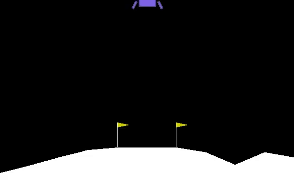

# Lunar-Lander-RL
This code base is an attempt to design an agent using Monte-Carlo Policy Gradient algorithm with baseline function. 
<p align="center">
  
</p>

## How to use
1. ``` git clone ``` the repository.
2. Enter the directory of the repository. ```cd Lunar-Lander-RL``` and open two terminal windows.
3. **Training**: Terminal window 1 command ```python3 reinforce_baseline.py --task train``` 
4. **To visualize live plots**: Terminal window 2 command ``` python plotting.py ```
5. You can change almost all variables by changing its value in reinforce_baseline.py.
6. After completion, the directory will have two new .txt files, two image files and two directories with saved models. Do not change the location of those files before testing.
7. **Testing**: ``` python reinforce_baseline.py --task train --exp_no 1 ``` . You need to change the experiment number 1 to any integer k as it represents the folder in ```Saved_Exps/Test_k``` where all the results will be saved.

## Results
Around 20 experiments were done with varyng hyperparameters and the best result in terms of solving the task - getting 200+ reward for 100 consequtive episodes in the least number of episodes is ```Test_11```. There were some tests which scored more rewards on 100 consequtive episodes than the model in Test_11. Each folder has a ```logfile.txt``` representing the hyperparams value, ```test_log.txt``` for test results, ```reward_log.txt``` for episode logs during training. 

## Dependencies
- Tesnorflow
- Gym
- Numpy
- MatPlotLib

Install them using [pip](https://pip.pypa.io/en/stable)

## Contributing 
Please feel free to create a Pull Request for any suggested improvements or error in the code. If you are a beginner, you can refer to [this](https://opensource.guide/how-to-contribute/) for getting started.

## Support
If you found this useful, please consider starring(★) the repo so that it can reach a broader audience.

## License
This project is licensed under the MIT License - see the [LICENSE](../master/LICENSE) file for details.

## References
- [Sutton RL Book](http://incompleteideas.net/book/RLbook2018trimmed.pdf)
- [David Silver Lectures](https://www.youtube.com/watch?v=KHZVXao4qXs&list=PL7-jPKtc4r78-wCZcQn5IqyuWhBZ8fOxT&index=7)
